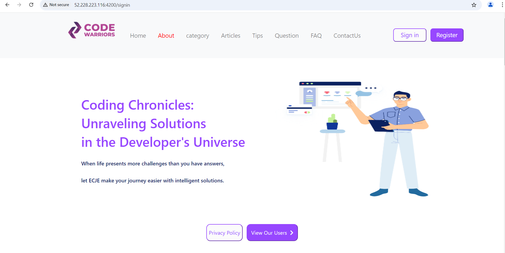

# About the project
Creation of an interactive website where learners can exchange their experiences and knowledge. The objective is to promote collaborative learning by enabling users to share their ideas, ask questions, and explore computer science challenges together.

## Built with
- **Front-End:** Angular, Bootstrap, TypeScript.
- **Back-End:** Spring Boot.
- **Database:** MySQL.

## Demo

## DevOps
**Implementation of a CI pipeline with Jenkins to automate deployment.**

**Integration of tests in CI with SonarQube to analyze code quality.**

**Configuration and management of a Kubernetes cluster using Kubernetes and Helm Charts.**

**Configuration of remote state in Azure to avoid conflicts, ensuring that all users always have the latest version of infrastructure configurations.**

**Implementation of a GitOps approach for continuous delivery with ArgoCD.**

**Backup Management:** Setting up database backups with scheduled automation using cron jobs.

**Test 1:** Data recovery test using the backup.
  )

  # Test 2: **Click on the image to watch the video.**

  

  

         

         

