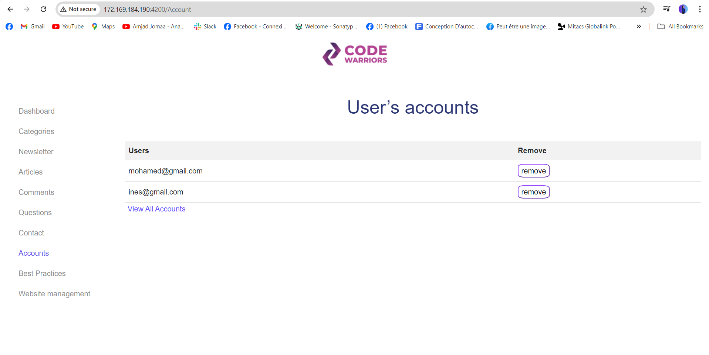
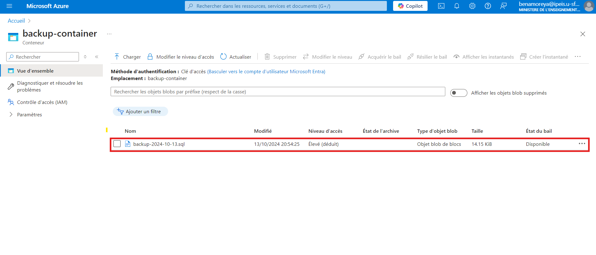
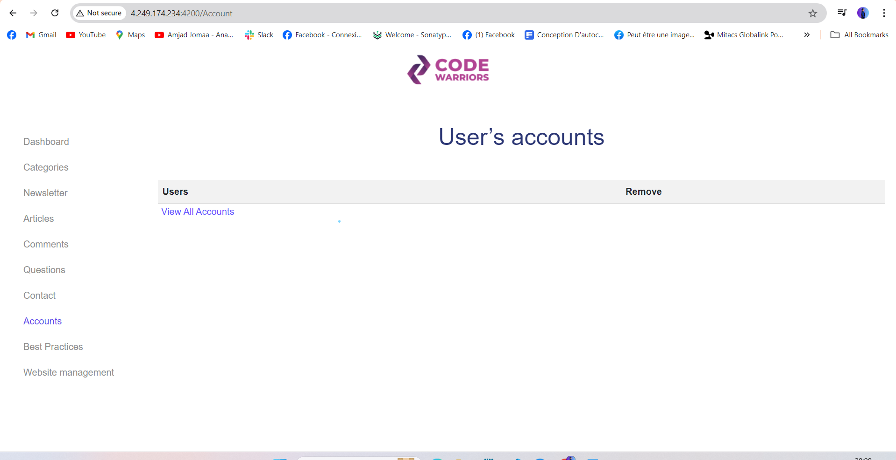
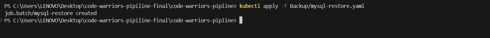
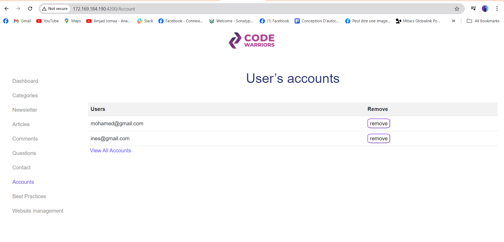

# About the project
Creation of an interactive website where learners can exchange their experiences and knowledge. The objective is to promote collaborative learning by enabling users to share their ideas, ask questions, and explore computer science challenges together.

## Built with
- **Front-End:** Angular, Bootstrap, TypeScript.
- **Back-End:** Spring Boot.
- **Database:** MySQL.

## Demo

## DevOps
**Implementation of a CI pipeline with Jenkins to automate deployment.**

**Integration of tests in CI with SonarQube to analyze code quality.**

**Configuration and management of a Kubernetes cluster using Kubernetes and Helm Charts.**

**Configuration of remote state in Azure to avoid conflicts, ensuring that all users always have the latest version of infrastructure configurations.**

**Implementation of a GitOps approach for continuous delivery with ArgoCD.**

**Backup Management:** Setting up database backups with scheduled automation using cron jobs.

**Test 1:** Data recovery test using the backup.

- **We have this data in our cluster.**
  
  
 - **The current database is stored in "moncomptebackup."**
  

- **Simulate a failure by deleting the cluster.**
 
- **After rebuilding the cluster, we notice that the data is missing.**
- 
   <!-- Replace with the link to your architecture image -->

- **Run the script to restore the data from the backup stored in "moncomptebackup."**
   <!-- Replace with the link to your architecture image -->

- **The data is successfully restored in the cluster**.
   <!-- Replace with the link to your architecture image -->
  **Test 2:**
  We will test how, when a developer changes something in the code and simply pushes the changes, everything updates automatically using a webhook.
  The CI pipeline in Jenkins will execute automatically, and ArgoCD will synchronize with Git, applying the modifications to the application in the cluster.
  

  

         

         

